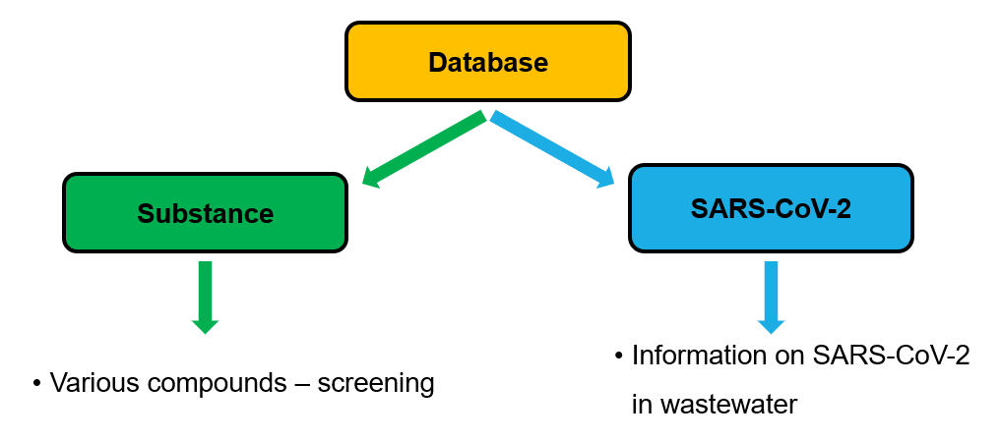
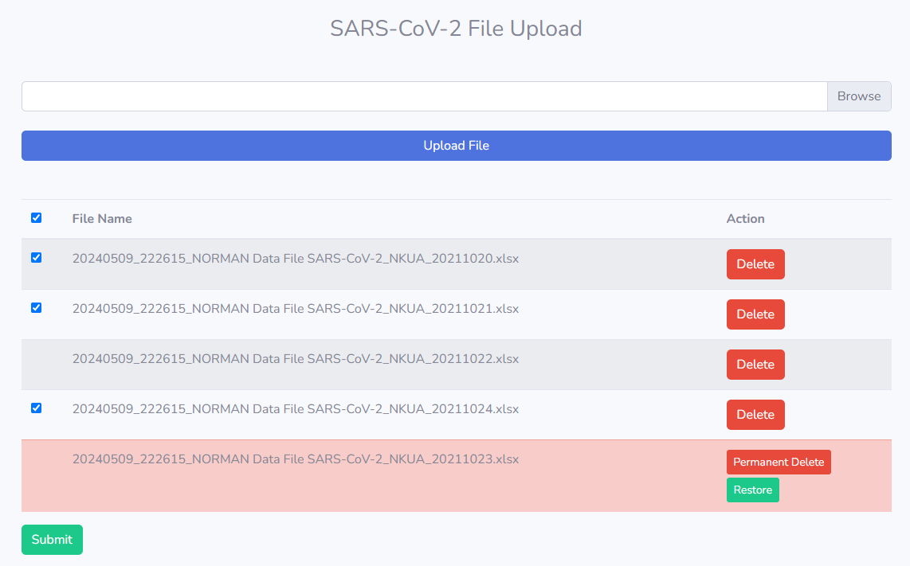
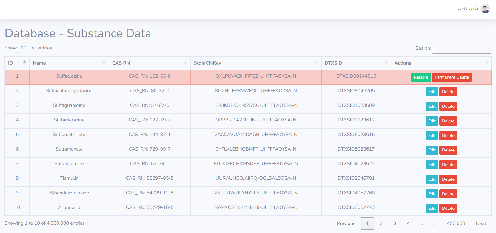
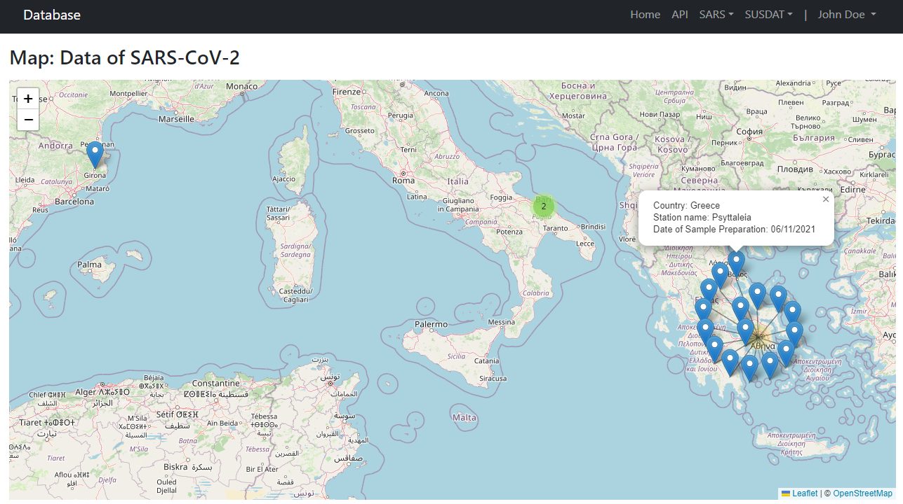
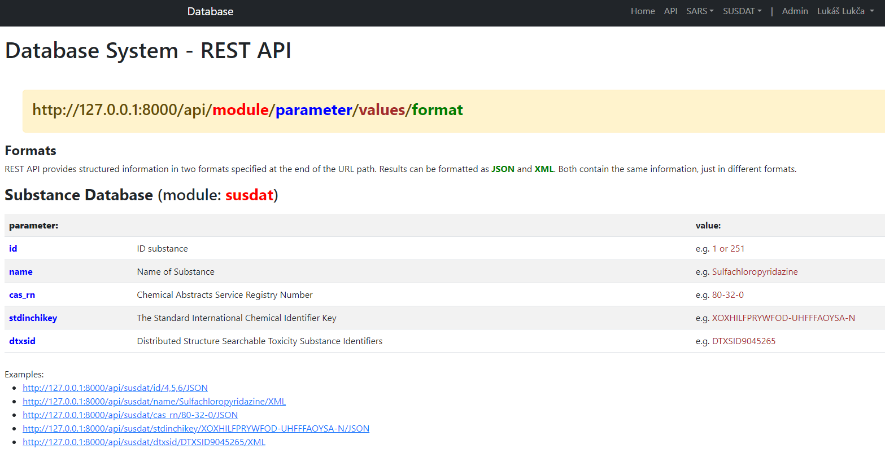
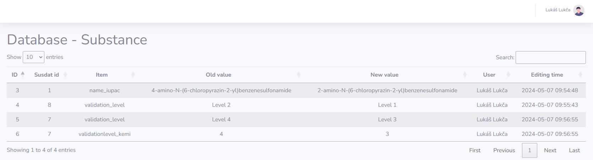

## Database system

The project was defended as a diploma thesis at the Slovak University of Technology in Bratislava.

## About

We created a database system that merges SARS-CoV-2 database and the Substance database.

Users of the website were divided into three groups: admin, reader, and guest. For the admin, we created a custom graphical interface. The reader and guest have a different graphical interface from the admin. The admin and reader log into the application. The guest does not log into the application. The guest has the option to register using a created registration form. After logging in, the admin and reader are divided into two groups. The reader does not have access to sections that are available only to the website admin.

Admin:

- unlimited options for viewing and reading records
- user management (assigning roles, CRUD)
- data collection and manipulation
- login retention

The reader and guest have the ability to view data from the SARS-CoV-2 and Substance databases. After logging in, the reader can view database records on a map and search using the REST API.

In the project, we compared three database modules based on performance: PostgreSQL, MySQL, and MongoDB. Additionally, we compared the performance of two caching modules: Redis and Memcached. We optimized the database modules based on hardware specifications, indexing, and data type adjustments. All tests were conducted using Grafana k6 Cloud. For testing purposes, we created a file in the project (testPerfomance.js) to define the test scenario.

## File Upload

The database records were stored in external Excel files, so we created forms for efficient data collection and processing. Only the admin has access to this section.

## Database - Table data

The database records are processed into a clear table. The JavaScript library YajraDataTables was applied. It includes built-in functions for pagination, sorting, and filtering table data. Data is loaded from the server in small chunks, improving performance and reducing server load. The admin can permanently delete data, perform a soft delete, or restore data that has been soft deleted.

## MAP

We used the freely available JavaScript library Leaflet to display records on the map. 

## REST API

## Change logs

